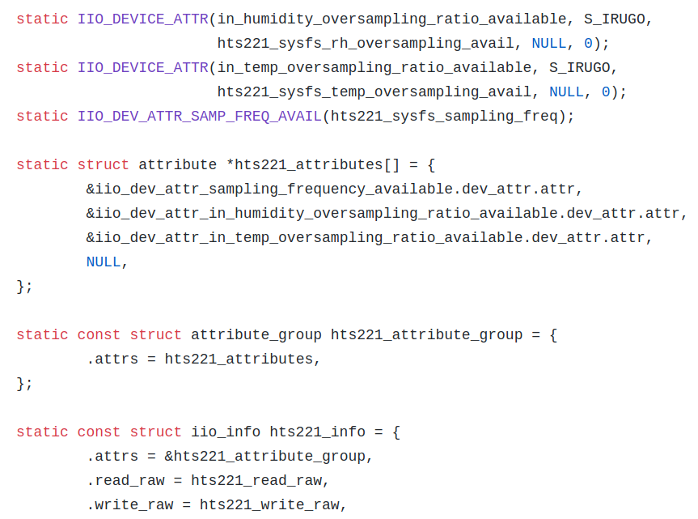

# Kernel Driver Documentation

This the documentation and notes I took while making the driver.

## References

https://www.youtube.com/watch?v=lBU77crSvcI (iio linux talk)

https://www.kernel.org/doc/Documentation/ABI/testing/sysfs-bus-iio (iio ABI docs)

https://github.com/torvalds/linux/tree/master/tools/iio (iio debug tool)

http://analogdevicesinc.github.io/libiio/ (user space program for talking with iio)

https://dbaluta.github.io/iiosubsys.html (iio tutorial)

https://github.com/torvalds/linux/tree/master/drivers/iio/pressure (iio example)

https://git.kernel.org/pub/scm/linux/kernel/git/gregkh/staging.git/tree/drivers/staging/iio/Documentation?id=refs/heads/staging-next (iio docs)

https://github.com/torvalds/linux/blob/master/drivers/iio/dummy/iio_simple_dummy.c (example code that also explains meaning of enums)

https://git.kernel.org/pub/scm/linux/kernel/git/gregkh/staging.git/tree/drivers/staging/iio/cdc/ad7746.c?id=refs/heads/staging-next (iio and i2c example)

https://git.kernel.org/pub/scm/linux/kernel/git/torvalds/linux.git/tree/drivers/iio/dac/ad5380.c?id=HEAD (iio with both i2c and SPI, selectable through macros)

https://opensourceforu.com/2017/01/regmap-reducing-redundancy-linux-code/ (regmap subsystem for easy i2c and spi register writing)

https://www.amazon.com/Linux-Device-Drivers-Development-customized-ebook/dp/B073V4LKWN (book has good chapter on regmap)

## HTU21D Driver

I copied most of sparkfun macros for register definition [here](https://github.com/sparkfun/SparkFun_HTU21D_Breakout_Arduino_Library/blob/master/src/SparkFunHTU21D.h), the rest is just implementation of the datasheet

I don't implement all of the features, just enough to read/write in hold mode as well as adjust the resolution and reset the device, the sensors took more time to measure than I expected so there is a delay function in there, future implementation may utilize this delay to do other stuffs(like ask for a measurements, then do something else and get back to grab it)

Special thanks to Sparkfun repo for the macros and the reference, the i2c protocol specified in the datasheet wasn't accurate of what the sensors wanted and Sparkfun reference code was really helpful

The HTU21D measures both temperature and humidity but due to the long delay time, I would probably use only the humidity and uses the temperature of the bmp280

## BMP280 driver

I ported most of the code from [Bosch Github](https://github.com/BoschSensortec/BMP280_driver#examples) and integrated it with the iio subsystem of the kernel, **THERE WAS A BUG** their uncomp number should have been s32(like the datasheet said) but it ended up being u32, which messed up a lot of things.

## Notes

Driver typically has 3 parts in two files: core(common part, can be named core or just the driver name alone), note that the i2c and spi parts are also in the same file, and they are declared like normal spi/i2c driver(using module_i2c_driver(mpl3115_driver)), **it's recommended to use regmap for common i2c and spi logic to reduce code duplicate**

Main files, take a device called device_b for example:

- device_b.h: function prototypes for iio common functions like probe, NOTE THAT SENSOR MACROS ARE PUT IN .c file instead, if there are many variants that the driver supports, put the enum and name of those variants here
- device_b.c: core driver, include channel structure definition, sensor enums, macros,

The struct **iio_dev** is the representation of an iio device, and contains things you need, the struct are set during the probe function of the device

The struct **iio_info** is the struct that has all the function pointers and attributes for the devices

### Main functions

- device_name_read_raw: used for read raw channel
- device_name_write_raw: used for writing to device stuffs like calibration data

### Buffer

IIO has extensive support for buffer, and if needed, should be configured in the channel specs

### Private data

Use iio_dev* = iio_device_alloc(sizeof(struct chip_state)), where chip_state is a specific data structure representing that sensor like bmp280_struct, can be accessed with iio_priv(struct iio_dev *)

### Setting Attributes

Attributes are information about devices and are set using macros:

```c

// S_IRUGO is for var that can be read but can not be changed by the world
// addr is the index of the channel you want the attribute to refer to
IIO_DEVICE_ATTR(var_name, mode, read_func, store_func, addr)
static struct attribute *dev_name_attributes[] = {
	&iio_dev_attr_var_name.dev_attr.attr,
    NULL,
};

static const struct attribute_group dev_attribute_group = {
	.attrs = dev_name_attributes,
};

static const struct iio_info var_info = {
	.attrs = &dev_attribute_group,
// ... other functions
};
```

